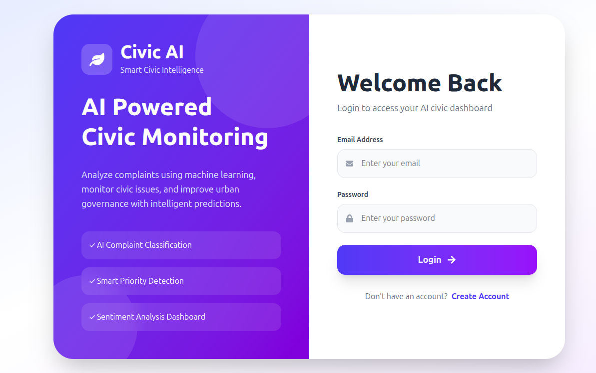
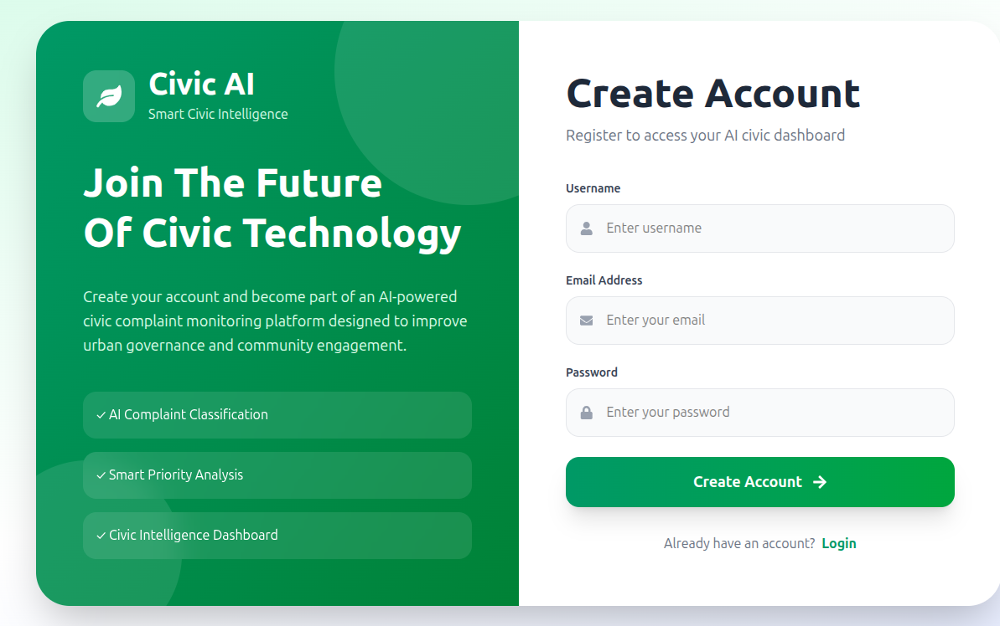
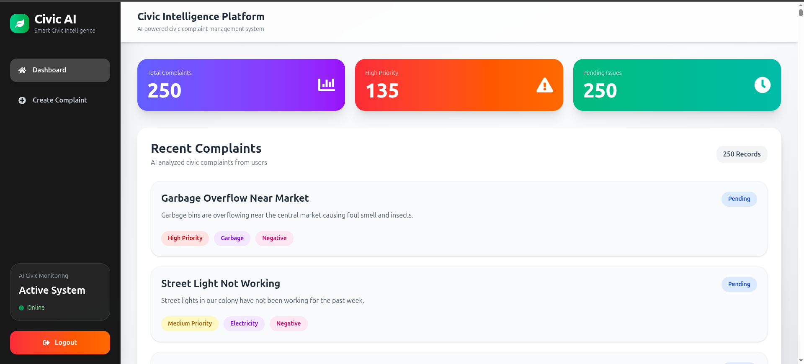
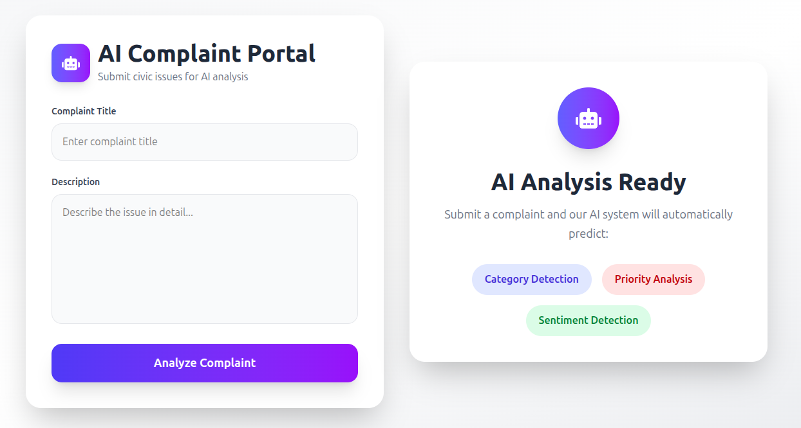
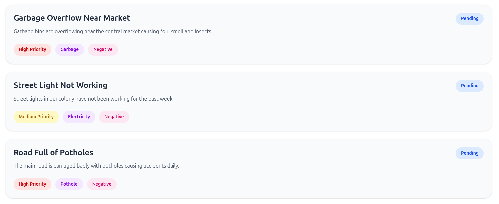

# Civic AI 🚀

An AI-powered civic complaint management platform built using FastAPI, React, PostgreSQL, and Machine Learning.

Civic AI allows users to submit civic complaints, automatically analyzes them using machine learning models, and provides intelligent predictions such as complaint category, priority level, and sentiment.

---

# 🌐 Live Demo

## Frontend


```bash
https://civic-ai-eight.vercel.app
```

## Backend API

Add your deployed backend URL here.

Example:

```bash
https://civic-ai-chz7.onrender.com
```

---

# ✨ Features

## 🔐 Authentication System

* User Registration
* User Login
* JWT Authentication
* Protected Routes
* Secure API Access

---

## 🤖 AI-Powered Complaint Analysis

The platform automatically predicts:

* Complaint Category
* Priority Level
* Sentiment

Example:

| Input Complaint                    | Prediction                    |
| ---------------------------------- | ----------------------------- |
| Garbage overflowing near market    | Environment / High / Negative |
| We planted 100 trees near roadside | Environment / Low / Positive  |

---

## 📊 Dashboard Analytics

* Total Complaints
* High Priority Issues
* Pending Complaints
* Complaint Feed
* Modern Responsive Dashboard UI

---

## 📝 Complaint Management

Users can:

* Create complaints
* View complaints
* Analyze complaints using AI
* Monitor civic issues

---

# 🧠 Machine Learning Features

This project uses machine learning models built with Scikit-learn.

### ML Tasks

* Text Classification
* Sentiment Analysis
* Priority Prediction

### ML Pipeline

1. Text preprocessing
2. TF-IDF vectorization
3. Model training
4. Prediction API integration

---

# 🏗️ Tech Stack

## Frontend

* React
* TypeScript
* Tailwind CSS
* React Router DOM
* Axios
* React Icons

---

## Backend

* FastAPI
* SQLAlchemy
* PostgreSQL
* JWT Authentication
* Pydantic
* Uvicorn

---

## Machine Learning

* Scikit-learn
* Pandas
* NumPy
* Joblib

---

## Deployment

### Frontend

* Vercel

### Backend

* Render

### Database

* PostgreSQL

---

# 📁 Project Structure

```bash
civicAI/
│
├── backend/
│   ├── app/
│   │   ├── main.py
│   │   ├── database.py
│   │   ├── models/
│   │   ├── routes/
│   │   ├── schemas/
│   │   ├── utils/
│   │   └── ml/
│   │
│   ├── requirements.txt
│   └── start.sh
│
├── frontend/
│   ├── src/
│   │   ├── components/
│   │   ├── pages/
│   │   ├── services/
│   │   └── routes/
│   │
│   ├── package.json
│   └── vite.config.ts
│
└── README.md
```

---

# ⚙️ Installation Guide

# 1️⃣ Clone Repository

```bash
git clone https://github.com/your-username/civicAI.git
```

```bash
cd civicAI
```

---

# 2️⃣ Backend Setup

```bash
cd backend
```

## Create Virtual Environment

```bash
python -m venv venv
```

## Activate Environment

### Linux/Mac

```bash
source venv/bin/activate
```

### Windows

```bash
venv\Scripts\activate
```

---

## Install Dependencies

```bash
pip install -r requirements.txt
```

## Run Backend

```bash
uvicorn app.main:app --reload
```

Backend runs on:

```bash
http://127.0.0.1:8000
```

---

# 3️⃣ Frontend Setup

```bash
cd frontend
```

## Install Dependencies

```bash
npm install
```

---

## Run Frontend

```bash
npm run dev
```

Frontend runs on:

```bash
http://localhost:5173
```

---

# 🚀 Deployment Guide

## Backend Deployment (Render)

### Build Command

```bash
pip install -r requirements.txt
```

### Start Command

```bash
uvicorn app.main:app --host 0.0.0.0 --port $PORT
```

---

# 📡 API Endpoints

## Authentication

| Method | Endpoint       | Description   |
| ------ | -------------- | ------------- |
| POST   | /auth/register | Register user |
| POST   | /auth/login    | Login user    |

---

## Complaints

| Method | Endpoint              | Description        |
| ------ | --------------------- | ------------------ |
| POST   | /complaints/complaint | Create complaint   |
| GET    | /complaints/get       | Get all complaints |

---

# 📸 Screenshots

Add screenshots here.

Suggested screenshots:

* Login Page

* Register Page

* Dashboard

* Create Complaint Page

* AI Prediction Results


---

# 🎯 Learning Outcomes

This project helped in learning:

* Full-stack development
* FastAPI backend development
* JWT authentication
* Machine learning integration
* REST API development
* React frontend development
* Database management
* Deployment workflows
* CORS handling
* Production debugging

---

# 👨‍💻 Author

## Aditya Yadav


# ⭐ Support

If you like this project:

* Star the repository
* Fork the project
* Contribute improvements

---

# 📜 License

This project is licensed under the MIT License.
